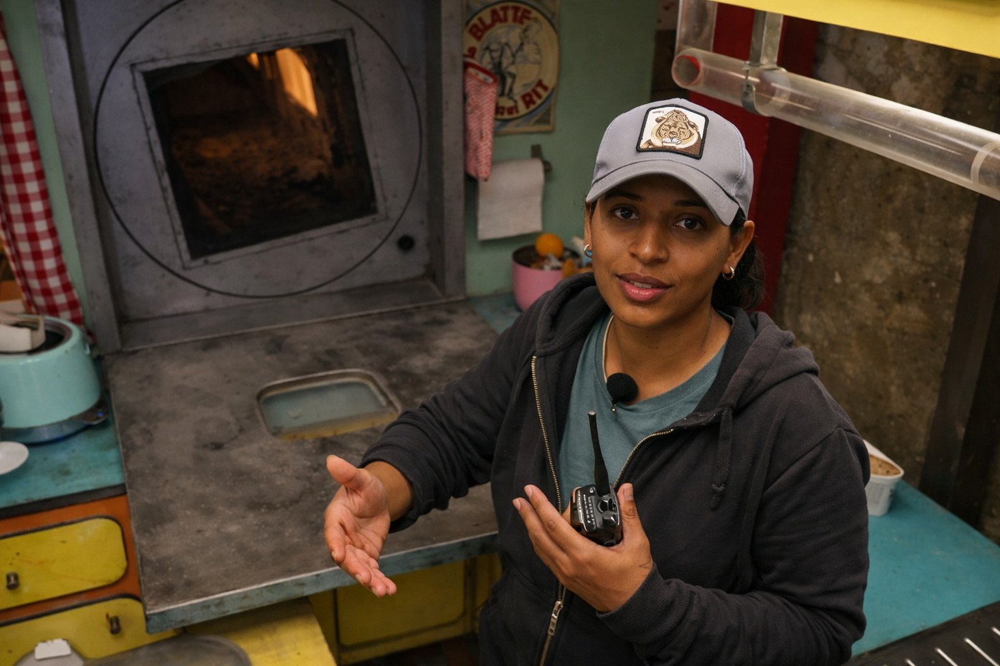
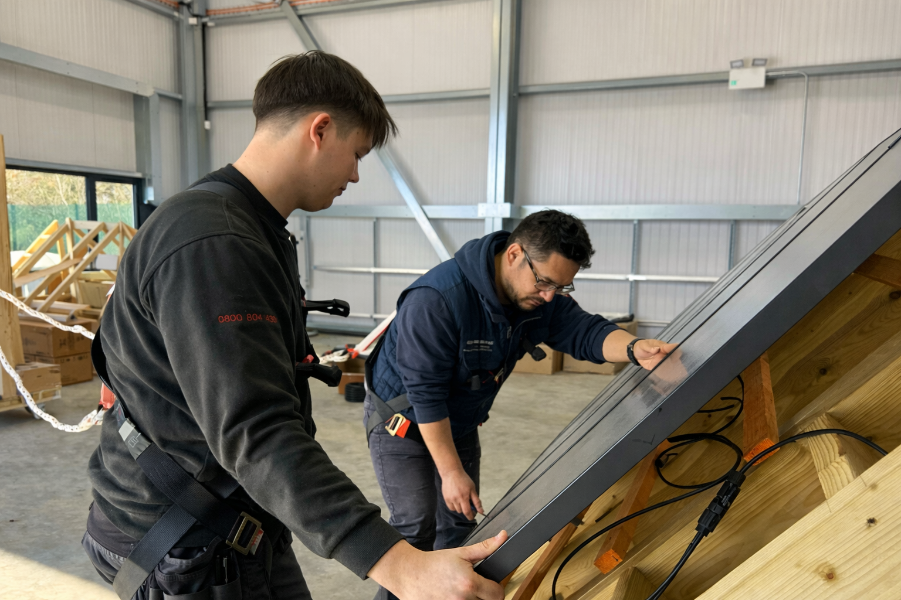
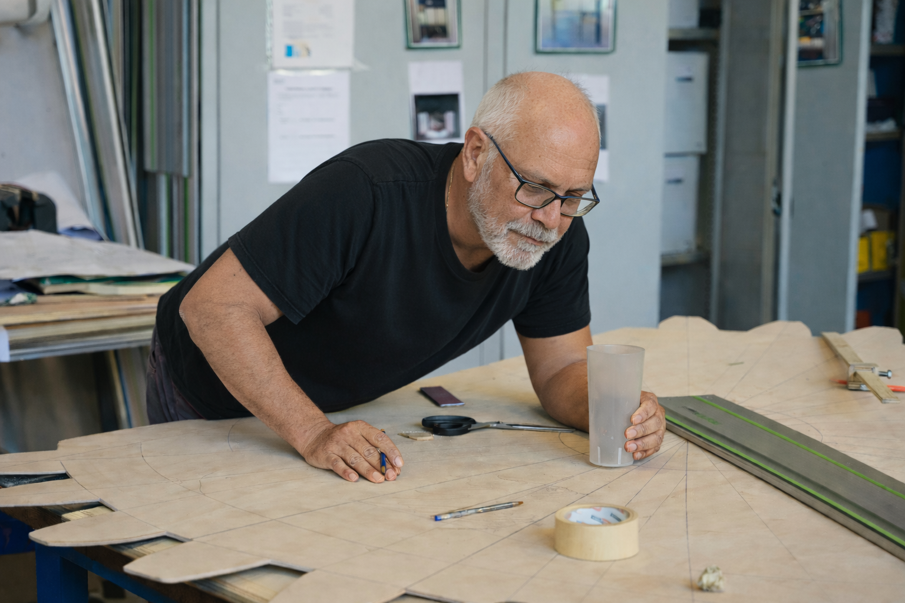
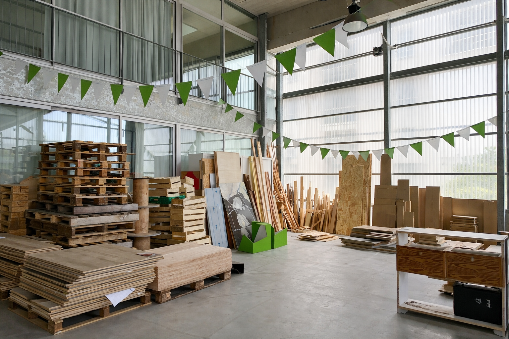

# MaterNova — Personae utilisateurs

---

## Persona 1 — Régisseur·euse général·e / Responsable de site

### Situation typique
Fin de projet. Démontage en cours. Délais serrés. Le lieu doit être vidé rapidement.

### Objectif principal
Se débarrasser de matériaux encore utilisables sans perdre de temps ni générer de coûts supplémentaires.

### Besoins
- Déclarer des lots rapidement
- Trouver des repreneurs à proximité
- Éviter la benne et les coûts associés

### Contraintes d’usage
- Fatigue liée à la fin de production
- Stress et multitâche
- Usage mobile, parfois en pénombre ou directement sur site

### Attentes fonctionnelles
- Publication guidée et rapide
- Informations lisibles immédiatement
- Nombre d’actions minimal

### Impacts sur la conception
Ce persona justifie la priorité donnée à une création d’annonce rapide, à une interface mobile-first, à la réduction du nombre de champs obligatoires et à une présentation des informations clés directement visibles sur les cartes d’annonces, sans nécessiter l’ouverture de la fiche détaillée.

---

## Persona 2 — Scénographe / Étudiant·e en arts ou design

### Situation typique
Recherche de matériaux pour un projet, un atelier ou un rendu, avec un budget très limité.

### Objectif principal
Trouver des matériaux exploitables sans recourir à l’achat neuf.

### Besoins
- Accéder à des sorties de stock locales
- Comprendre rapidement si un matériau est utilisable
- Pouvoir récupérer sans logistique lourde

### Contraintes d’usage
- Budget restreint
- Lecture rapide, souvent sur mobile
- Matériel ou connexion parfois anciens

### Attentes fonctionnelles
- Filtres simples
- Descriptions claires et concrètes
- Absence de jargon technique inutile

### Impacts sur la conception
Ce persona justifie la mise en place de filtres limités à quelques critères métiers essentiels, ainsi que des descriptions organisées selon une structure fixe et identique pour toutes les annonces (type de matériau, quantité ou volume, état, contraintes de récupération), afin de permettre une consultation rapide sans surcharge d’informations.

---

## Persona 3 — Chef·fe de chantier / Responsable technique

### Situation typique
Anticipation ou ajustement de besoins matériels en cours de chantier.

### Objectif principal
Sécuriser rapidement des matériaux disponibles à moindre coût.

### Besoins
- Identifier des volumes disponibles
- Comparer distances et types de matériaux
- Fiabiliser une alternative aux fournisseurs classiques

### Contraintes d’usage
- Forte pression sur les délais
- Consultation rapide
- Environnement bruyant ou déplacements fréquents

### Attentes fonctionnelles
- Vue synthétique
- Données fiables
- Lecture immédiate, sans interprétation

### Impacts sur la conception
Ce persona justifie une présentation synthétique des annonces, la priorisation d’informations factuelles et mesurables (type, volume, localisation) et l’exclusion de formulations subjectives ou imprécises, afin d’éviter toute ambiguïté avant le déplacement.

---

## Persona 4 — Associations / Tiers-lieux / Fablabs

### Situation typique
Organisation collective de récupérations pour des ateliers ou projets partagés.

### Objectif principal
Accéder à des matériaux adaptés aux capacités du lieu et des équipes.

### Besoins
- Matériaux gratuits ou à faible coût
- Compréhension claire des contraintes logistiques
- Anticipation pour éviter les mauvaises surprises

### Contraintes d’usage
- Équipes mixtes (bénévoles, publics variés)
- Compétences numériques hétérogènes
- Temps de coordination limité

### Attentes fonctionnelles
- Annonces compréhensibles par tous
- Volumes et conditions explicites
- Interface simple et robuste

### Impacts sur la conception
Ce persona justifie une interface volontairement simple, des annonces explicites, et une tolérance aux différents niveaux de maîtrise numérique, sans fonctionnalités complexes.

---

## Persona 5 — Écoles et formations
*(arts, design, architecture, spectacle)*

### Situation typique
Préparation de cours, workshops, projets pédagogiques ou productions étudiantes.

### Objectif principal
Mettre les étudiant·es en contact avec des matériaux réels.

### Besoins
- Accès à des ressources locales variées
- Anticipation des besoins pédagogiques
- Récupération facilitée et sécurisée

### Contraintes d’usage
- Usages partagés (enseignant·es / étudiant·es)
- Diversité des capacités (visuelles, cognitives, motrices)
- Accès collectif à l’outil

### Attentes fonctionnelles
- Informations structurées
- Parcours accessibles sans dépendance à la couleur
- Outil utilisable sans formation spécifique

### Impacts sur la conception
Ce persona justifie une organisation de l’information stable et répétitive, des interfaces compréhensibles sans code couleur implicite, et un outil permettant d’agir immédiatement sans connaissance préalable du numérique ou de l’interface.
